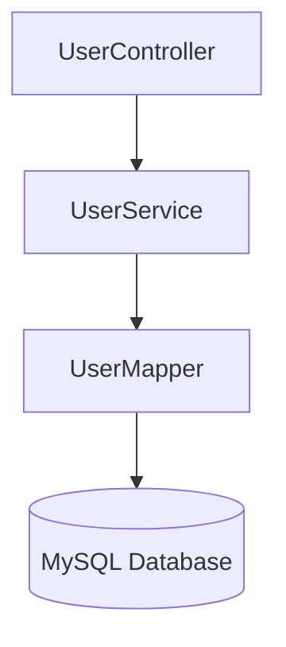

# User 模块

## 模块概述

用户管理模块，负责用户的注册、查询、更新和删除功能。

---

## 架构设计

### 类结构

| 类名 | 职责 | 路径 |
|------|------|------|
| UserController | 处理 HTTP 请求 | controller/UserController.java |
| UserService | 业务逻辑处理 | service/UserService.java |
| UserMapper | 数据访问层 | mapper/UserMapper.java |
| User | 实体类 | entity/User.java |

### 依赖关系

---

## 数据模型

### 数据库表结构

**表名**: `user`

| 字段 | 类型 | 约束 | 说明 |
|------|------|------|------|
| id | BIGINT | PK, AUTO_INCREMENT | 主键 |
| username | VARCHAR(50) | NOT NULL, UNIQUE | 用户名 |
| email | VARCHAR(100) | NOT NULL | 邮箱 |
| password | VARCHAR(100) | NOT NULL | 密码 |
| created_at | TIMESTAMP | DEFAULT CURRENT_TIMESTAMP | 创建时间 |
| updated_at | TIMESTAMP | DEFAULT CURRENT_TIMESTAMP | 更新时间 |

### 实体类字段

**路径**: `src/main/java/org/example/entity/User.java`

| 字段 | Java 类型 | 说明 |
|------|-----------|------|
| id | Long | 主键 |
| username | String | 用户名 |
| email | String | 邮箱 |
| password | String | 密码 |

**注意**: 数据库有 `created_at` 和 `updated_at` 字段，但实体类未映射。

---

## 业务流程

### 用户注册流程

1. 接收用户注册请求（username, email, password）
2. 校验用户名是否已存在
3. 插入用户数据到数据库
4. 返回创建成功的用户信息

### 用户查询流程

1. 接收查询请求（by id 或 by username）
2. 从数据库查询用户信息
3. 返回用户数据

### 用户更新流程

1. 接收更新请求（id + 待更新字段）
2. 校验用户是否存在
3. 更新非空字段到数据库
4. 返回更新后的用户信息

### 用户删除流程

1. 接收删除请求（id）
2. 校验用户是否存在
3. 从数据库删除用户
4. 返回删除成功状态

---

## 数据访问层

### UserMapper 接口

**路径**: `src/main/java/org/example/mapper/UserMapper.java`

| 方法 | 参数 | 返回值 | 说明 |
|------|------|--------|------|
| selectById | Long id | User | 按 ID 查询用户 |
| selectByUsername | String username | User | 按用户名查询 |
| selectAll | 无 | List\<User\> | 查询所有用户 |
| insert | User user | int | 插入用户 |
| update | User user | int | 更新用户 |
| deleteById | Long id | int | 删除用户 |

### SQL 映射

**路径**: `src/main/resources/mapper/UserMapper.xml`

- 命名空间: `org.example.mapper.UserMapper`
- 结果映射: `BaseResultMap`
- SQL 片段: `Base_Column_List`

---

## 业务逻辑层

### UserService 类

**路径**: `src/main/java/org/example/service/UserService.java`

| 方法 | 说明 |
|------|------|
| getUserById(Long id) | 查询单个用户 |
| getUserByUsername(String username) | 按用户名查询 |
| getAllUsers() | 获取所有用户 |
| createUser(User user) | 创建用户 |
| updateUser(User user) | 更新用户 |
| deleteUser(Long id) | 删除用户（返回 boolean） |

**注意**:
- 当前为简单 CRUD 代理，无额外业务逻辑
- 没有事务管理（`@Transactional`）
- 没有参数校验

---

## 控制层

### UserController 类

**路径**: `src/main/java/org/example/controller/UserController.java`

**基础路径**: `/api/users`

| HTTP 方法 | 路径 | 说明 |
|-----------|------|------|
| GET | `/api/users/{id}` | 获取单个用户 |
| GET | `/api/users` | 获取所有用户 |
| POST | `/api/users` | 创建用户 |
| PUT | `/api/users/{id}` | 更新用户 |
| DELETE | `/api/users/{id}` | 删除用户 |

详细 API 文档请查看 [User API](../api/User.md)

---

## 配置说明

| 配置项 | 默认值 | 说明 |
|--------|--------|------|
| mybatis.mapper-locations | classpath:mapper/*.xml | Mapper XML 文件位置 |
| mybatis.type-aliases-package | org.example.entity | 实体类包路径 |
| mybatis.configuration.map-underscore-to-camel-case | true | 下划线转驼峰 |

---

## 更新日志

| 日期 | 版本 | 变更内容 |
|------|------|----------|
| 2026-07-15 | 1.0.0 | 初始版本，基础 CRUD 功能 |
