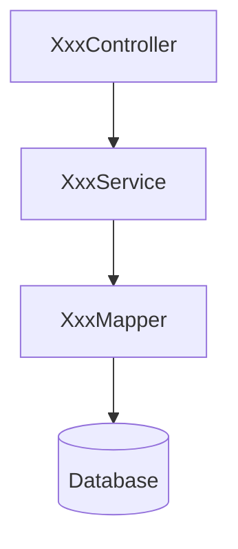

# 文档同步规则

> **核心原则**：代码与文档必须实时同步，确保文档始终反映当前代码状态。

---

## 触发条件

以下场景**必须**同步读取或更新相关文档：

| 场景 | 操作要求 |
|------|----------|
| 读取代码文件 | 同步读取对应的模块文档（如有） |
| 生成新代码 | 同步创建或更新对应的模块文档和 API 文档 |
| 修改现有代码 | 同步更新对应的模块文档和 API 文档 |
| 删除代码 | 同步更新或删除对应的文档内容 |
| 代码审查 | 同步读取相关文档进行对比验证 |

---

## 文档目录结构

```
docs/
├── api/                    # API 接口文档
│   ├── User.md            # 用户模块 API
│   ├── Order.md           # 订单模块 API
│   └── ...
├── modules/               # 模块说明文档
│   ├── User.md            # 用户模块说明
│   ├── Order.md           # 订单模块说明
│   └── ...
└── schemas/               # 数据模型文档
    ├── User.md            # 用户数据模型
    └── ...
```

---

## 文档粒度标准

**按业务模块组织**，每个模块包含：
- 模块概述
- API 接口定义
- 数据模型
- 依赖关系
- 业务逻辑说明

---

## API 文档模板

```markdown
# [模块名] API

## 概述
简要描述模块的功能和职责。

## 接口列表

### [接口名称]
- **HTTP 方法**: `GET/POST/PUT/DELETE`
- **路径**: `/api/xxx/xxx`
- **描述**: 接口功能说明

#### 请求参数
| 参数名 | 类型 | 必填 | 说明 |
|--------|------|------|------|
| param1 | String | 是 | 参数说明 |
| param2 | Integer | 否 | 参数说明 |

#### 请求示例
```json
{
  "param1": "value1",
  "param2": 123
}
```

#### 响应结果
| 字段 | 类型 | 说明 |
|------|------|------|
| code | Integer | 状态码 |
| message | String | 提示信息 |
| data | Object | 返回数据 |

#### 响应示例
```json
{
  "code": 200,
  "message": "success",
  "data": {}
}
```

#### 错误码
| 错误码 | 说明 |
|--------|------|
| 400 | 请求参数错误 |
| 401 | 未授权 |
| 404 | 资源不存在 |
| 500 | 服务器内部错误 |

#### 前置条件
- 用户已登录
- 拥有相应权限

#### 权限要求
- 角色: admin / user
- 权限: user:read, user:write

#### 关联接口
- [相关接口1](#接口1)
- [相关接口2](#接口2)
```

---

## 模块文档模板

```markdown
# [模块名] 模块

## 模块概述
简要描述模块的业务功能和职责范围。

## 架构设计

### 类结构
| 类名 | 职责 | 路径 |
|------|------|------|
| XxxController | 处理 HTTP 请求 | controller/XxxController.java |
| XxxService | 业务逻辑处理 | service/XxxService.java |
| XxxMapper | 数据访问层 | mapper/XxxMapper.java |
| Xxx | 实体类 | entity/Xxx.java |

### 依赖关系


## 数据模型

### 数据库表结构
| 字段 | 类型 | 约束 | 说明 |
|------|------|------|------|
| id | BIGINT | PK, AUTO_INCREMENT | 主键 |
| name | VARCHAR(50) | NOT NULL | 名称 |
| created_at | TIMESTAMP | DEFAULT NOW | 创建时间 |

### 实体类字段
| 字段 | 类型 | 说明 |
|------|------|------|
| id | Long | 主键 |
| name | String | 名称 |
| createdAt | LocalDateTime | 创建时间 |

## 业务流程

### [流程名称]
1. 步骤1：说明
2. 步骤2：说明
3. 步骤3：说明

## 配置说明
| 配置项 | 默认值 | 说明 |
|--------|--------|------|
| xxx.enabled | true | 是否启用 |

## 更新日志
| 日期 | 版本 | 变更内容 |
|------|------|----------|
| 2026-07-15 | 1.0.0 | 初始版本 |
```

---

## 同步检查清单

在完成代码变更后，检查以下内容：

- [ ] 对应的模块文档是否已创建/更新
- [ ] API 文档是否包含所有新增/修改的接口
- [ ] 数据模型文档是否反映最新的表结构和实体类
- [ ] 文档中的代码示例是否与实际代码一致
- [ ] 依赖关系图是否需要更新
- [ ] 更新日志是否已记录变更

---

## 注意事项

1. **实时性**：代码变更后立即更新文档，不要延迟
2. **完整性**：文档必须包含模板要求的所有字段
3. **准确性**：文档内容必须与代码实际行为一致
4. **一致性**：所有文档使用统一的模板格式
5. **可追溯性**：重要变更必须记录在更新日志中
